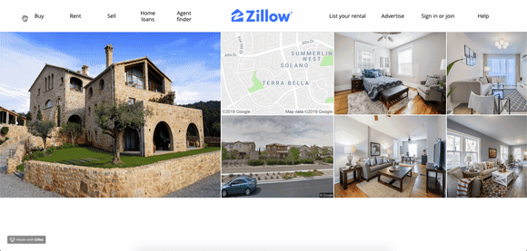
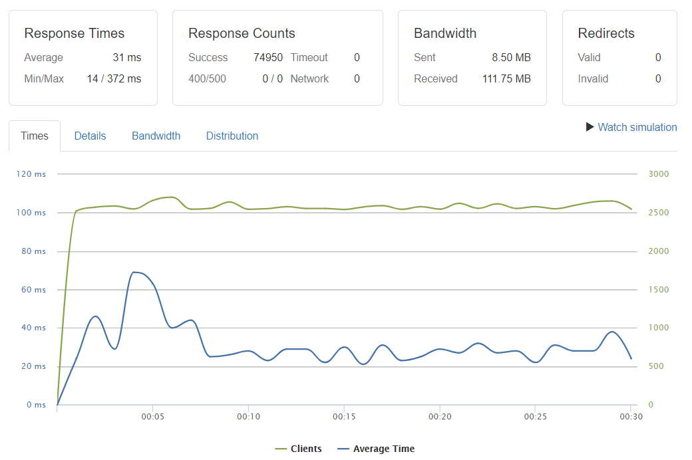

# Zeelow Gallery

*Zeelow Gallery* is a scalable and clean image carousel designed to handle a large user base and optimized for speed. This project is an evolution of a [legacy commentary system](https://github.com/hack-reactor-front-end-abrm/Gallery-Service) that sought to replicate Zillow's gallery component. Zeelow Gallery builds on the legacy project by introducing a number of improvements:
- 🚀 Transition from `SQLite` to a more robust and scalable `MongoDB` database
- 👍 Server and client enhancements to handle extreme bursts in concurrent requests
  - Completely revamped client-side code that behaves well when positioned behind a load balancer such as `Nginx`
- 🎯 Database schema improvements
  - Appropriate indexing based on most commonly requested endpoints
- 🚢 Dockerfile for rapid deployment

## Related Projects

- [Proxy Server](https://github.com/team-dracula/gallery-proxy)

## Table of Contents

1. [Overview](#overview)
1. [Requirements](#requirements)
1. [Usage](#usage)
1. [Environment Variables](#environment%20variables)

## Overview

#### Client Interface:

#### Stress tests:
- Database server hosted on a single EC2 t2.micro
  - 10 million `house` records 
- Node.js component server hosted on 4 EC2 t2.micros load balanced with Nginx
- Each request is a `GET` request for a random API endpoint (a house with `id` between `1` and `10,000,000`)
##### 2,500 Requests Per Second Over 60 Seconds (<0.1% Error Rate)

## Requirements

- Node v10.13.0 (LTS as of May 2019) or higher
- Nodemon if using the default `npm` script
- MongoDB for the database server

## Usage

#### Server
> 1. Install dependencies with `npm install`
> 2. After connecting to the database, from the root directory run `node database/mongoDB/seed.js`
> 3. The main server file is `server/server.js`
> -- If nodemon is already installed globally (it is not part of the dependencies), you may start the server via `npm run server-dev` for development purposes or `npm start` for production
> -- The server uses port 3010 by default, but you may set it using an environment variable `process.env.PORT`

#### Client
> The client side is built using Parcel:
>> `npm run dev`: Builds the client-side files in development mode and does not do full bundling. This also activates watch mode by default so it rebuilds whenever you make and save changes
>
>> `npm run build`: Builds the client-side files in production mode, with full bundling. This reduces file size, but is less useful in debugging (some errors do not provide as much detail as in development mode)

## Environment Variables

##### The following environment variables must be provided to the Node.js server
> - `PORT`: Port used by the HTTP server; defaults to `3010` 
> - `MONGO_DB`: MongoDB host address; defaults to localhost